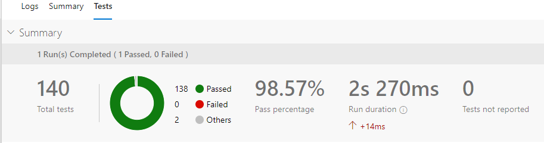

# Fork: azure-arm-testing

This is a fork of Leandro's excellent pester tests for ARM templates. I had some issues with linked templates and passwords which reference Key Vault so I've fixed those in this version.

## Testing Azure RM Templates with Pester

These repo contains a Pester script to test common mistake when authoring ARM Templates which can help to reduce the development time. The tests are aimed to validate:

* JSON Structure: *it doesn't have syntax errors*
* Referenced Parameters: *All parameters referenced in the json file are defined in the parameters section*
* References Variables: *All variables referenced in the json file are defined in the variables section*
* Missing opening or closing square brackets/parenthesis: *All lines aren't missing any of these two opening/closing symbols*
* Azure API Validation: *Use Test-AzureRmResourceGroupDeployment to complete validation against Azure*

More details can be found at [this blog entry](http://leandrowp.blog/2018/10/07/validating-azure-arm-templates-with-pester)

## Use in Azure DevOps

You can use this in Azure DevOps Pipelines using two tasks. First, create an Azure PowerShell task to run the tests:

````
- task: AzurePowerShell@4
  enabled: true
  displayName: 'Run Pester tests.'
  inputs:
    azureSubscription: $(serviceconnection)
    ScriptType: FilePath
    ScriptPath: '$(deploymentRoot)/Tests/Run-Pester.ps1'
    ScriptArguments: -TestFilePattern '*.tests.ps1'
    azurePowerShellVersion: LatestVersion
  continueOnError: false
````

And next, publish the test results:

````
- task: PublishTestResults@2
  displayName: 'Publish Test Results **\TEST-*.xml'
  inputs:
     testResultsFormat: NUnit
     testResultsFiles: '**\TEST-*.xml'
     failTaskOnFailedTests: true
````

If the tests were successfully published, you'll see something like below:


